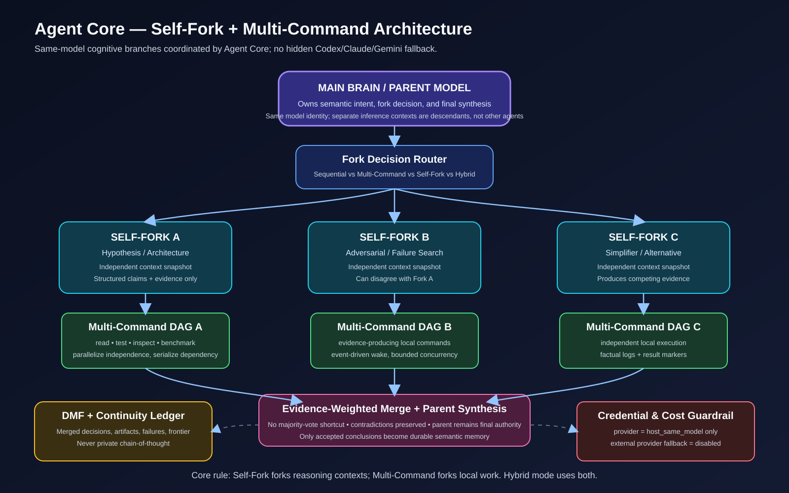

# Agent Core Self-Fork Integration - Master Plan

> **Status: PLANNING ONLY - NOT IMPLEMENTED.**
>
> This plan extends the currently stable Local Continuity + Deterministic Execution Fabric without changing the meaning of the existing system. Implementation must proceed in an isolated worktree with TDD, checkpoints, factual evidence, and staged rollout.

**Goal:** Add a first-class **Self-Fork / Cognitive Fork Fabric** to Agent Core so the main model can split one difficult objective into multiple independent reasoning contexts derived from the **same model identity and parent context lineage**, let each branch use the existing deterministic Multi-Command Execution Fabric when useful, then merge structured evidence back into one parent decision.

**Non-negotiable definition:**

```text
Multi-Command Async = one reasoning parent + many local command nodes.
Self-Fork           = one reasoning parent + multiple independent same-model reasoning contexts.
Hybrid              = multiple same-model reasoning contexts, each able to run Multi-Command DAGs.
```

**Self-Fork does NOT mean:** silently calling Codex, Claude, Gemini, another AI agent, another provider, or an unapproved API credential.

**Critical platform boundary:** Agent Core/MCP can orchestrate and persist fork state, but it must not pretend it can manufacture another copy of the active ChatGPT inference by itself. A real Self-Fork requires a **host-provided same-model branch invocation primitive**. If that primitive is unavailable, Agent Core must report Self-Fork unavailable and fall back to the current single-parent + Multi-Command behavior. It must **never silently switch to an external model API**.

**Current substrate preserved:**

- DMF remains durable semantic memory.
- Continuity Ledger remains project/task continuity source of truth.
- Deterministic Execution Fabric remains the command/DAG execution layer.
- Event-driven wake remains persisted-before-signal and non-busy-polling.
- `capability_route` remains the actionable entry point.
- `task_checkpoint` remains the semantic task finalization boundary.
- OAuth/custom Agent Core authentication behavior remains unchanged.
- No private chain-of-thought is persisted.

## Architecture Image



Canonical image file:

```text
docs\diagrams\agent-core-self-fork-architecture.svg
```

---

# 1. Core Product Invariants

These rules must remain true at every implementation stage.

1. **Same-model lineage, not hidden multi-agent routing.** A fork branch is a descendant reasoning context of the parent model configuration, not Codex/Claude/Gemini or an unrelated autonomous agent.
2. **No additional Self-Fork credential in v1.** Agent Core must not require an OpenAI API key, Codex credential, Claude key, Gemini key, or provider token for the default Self-Fork path.
3. **No external-provider fallback.** If the host cannot create same-model branches, Self-Fork returns unavailable; current Multi-Command behavior continues.
4. **Parent remains semantic authority.** Fork branches can investigate, challenge, and recommend; the parent performs the final synthesis/decision.
5. **Evidence outranks majority vote.** Three branches agreeing is not sufficient if a fourth branch has stronger factual evidence.
6. **No private chain-of-thought storage.** Store only observable objective, branch role, structured claims, evidence references, tool actions/results, conclusions, confidence, contradictions, and state transitions.
7. **DMF accepts only reviewed/merged semantic output.** Raw branch working state does not automatically become durable truth.
8. **Tool permissions never expand during a fork.** Every branch inherits the parent principal/project scope and an equal-or-narrower tool policy.
9. **No uncontrolled recursive explosion.** v1 Self-Fork depth is one level only; recursive sub-forks are explicitly out of scope until separately certified.
10. **Multi-Command and Self-Fork stay distinct.** Command parallelism remains deterministic local execution; reasoning parallelism remains host-mediated cognitive branching.
11. **No shared-checkout concurrent source mutation in v1.** Fork branches investigate/read/test/propose. Final source mutation is applied by the parent after merge, unless a future isolated-worktree branch mode is explicitly implemented.
12. **Failure is factual.** A missing branch, host disconnect, missing process, timeout, or session closure is never interpreted as success.

---

# 2. Target Workflow - ASCII Overview

```text
USER REQUEST
    |
    v
capability_route
    |
    +--> OAuth / principal / project scope
    +--> DMF recall
    +--> Continuity rehydration
    |
    v
MAIN BRAIN / PARENT
    |
    v
PROBLEM SHAPE ROUTER
    |
    +----------------------+----------------------+----------------------+
    |                      |                      |                      |
    v                      v                      v                      v
SEQUENTIAL            MULTI-COMMAND          SELF-FORK               HYBRID
simple/dependent      >=2 independent        ambiguous reasoning      reasoning + commands
work                  command nodes          hypotheses               both parallel
    |                      |                      |                      |
    |                      v                      v                      v
    |               Execution Fabric        Fork Fabric          Fork Fabric
    |               DAG + Wake             Branch A/B/C         Branch A/B/C
    |                      |                      |                  |    |    |
    |                      |                      |                  v    v    v
    |                      |                      |              Exec DAGs per branch
    |                      |                      |                  |    |    |
    +----------------------+----------------------+------------------+----+----+
                                                   |
                                                   v
                                         STRUCTURED BRANCH OUTPUTS
                                         claims + evidence + confidence
                                                   |
                                                   v
                                         EVIDENCE-WEIGHTED MERGE
                                                   |
                                                   v
                                           PARENT SYNTHESIS
                                                   |
                         +-------------------------+-------------------------+
                         |                                                   |
                         v                                                   v
                 verified actions/patches                           accepted semantic state
                         |                                                   |
                         v                                                   v
                 Execution / local tools                         DMF + Continuity Ledger
                         |                                                   |
                         +-------------------------+-------------------------+
                                                   |
                                                   v
                                            task_checkpoint
                                                   |
                                                   v
                                      NEXT SESSION CAN REHYDRATE
```

---

# 3. What a Self-Fork Actually Contains

A fork must receive a bounded **structured parent snapshot**, not the parent's hidden reasoning.

Proposed branch envelope:

```ts
interface ForkBranchEnvelope {
  forkRunId: string;
  branchId: string;
  parentTaskId: string;
  parentRouteContextId: string;
  principalId: string;
  projectId: string;

  modelLineage: {
    mode: 'host_same_model';
    externalProviderFallback: false;
    parentSnapshotHash: string;
  };

  role: string;
  objective: string;
  constraints: string[];
  acceptanceCriteria: string[];
  contextRefs: Array<{
    type: 'memory' | 'file' | 'artifact' | 'execution' | 'checkpoint';
    ref: string;
  }>;

  allowedTools: string[];
  budget: {
    maxToolCalls?: number;
    deadlineMs?: number;
  };

  outputContract: 'structured_fork_conclusion_v1';
}
```

A branch returns only structured observable output:

```ts
interface ForkConclusion {
  branchId: string;
  status: 'completed' | 'failed' | 'cancelled' | 'interrupted';
  conclusion: string;
  claims: Array<{
    claim: string;
    evidenceRefs: string[];
    confidence: number;
  }>;
  contradictions: string[];
  unresolved: string[];
  recommendedActions: string[];
  artifactRefs: string[];
}
```

No field exists for hidden chain-of-thought.

---

# 4. Self-Fork + Multi-Command Hybrid Workflow

```text
                         MAIN BRAIN / PARENT
                                |
                     objective + constraints
                                |
                        fork_create(...)
                                |
               +----------------+----------------+
               |                |                |
               v                v                v
          SAME-MODEL        SAME-MODEL       SAME-MODEL
            FORK A            FORK B           FORK C
        Architecture       Adversarial        Simplifier
               |                |                |
        decomposition      decomposition     decomposition
               |                |                |
        +------+------+    +------+------+   +------+------+
        |             |    |             |   |             |
        v             v    v             v   v             v
      Cmd A1        Cmd A2 Cmd B1       Cmd B2 Cmd C1      Cmd C2
        |             |    |             |   |             |
        +------+------+    +------+------+   +------+------+
               |                |                |
               v                v                v
        factual evidence   factual evidence factual evidence
               |                |                |
               v                v                v
       ForkConclusion A   ForkConclusion B ForkConclusion C
               |                |                |
               +----------------+----------------+
                                |
                                v
                     fork_merge_prepare(...)
                                |
                    contradiction matrix
                    evidence provenance
                    confidence calibration
                                |
                                v
                         PARENT SYNTHESIS
                                |
             +------------------+------------------+
             |                                     |
             v                                     v
       final implementation                 reviewed memory commit
       through normal tools                 through task_checkpoint
```

**Meaning:** Self-Fork parallelizes cognition. Existing Multi-Command parallelizes local execution inside a branch or parent. They are complementary layers, not synonyms.

---

# 5. Proposed Runtime Components

```text
src/fork/
  types.ts                # contracts and states
  schema.ts               # fork SQLite schema
  db-worker.ts            # isolated SQLite worker
  worker-client.ts        # worker RPC
  store.ts                # principal/project-scoped durable state
  context.ts              # bounded parent snapshot builder
  policy.ts               # when Self-Fork is useful / allowed
  host-bridge.ts          # same-model host dispatch contract
  service.ts              # lifecycle orchestration
  wake.ts                 # event-driven fork wake
  merge.ts                # evidence/contradiction preparation
  recovery.ts             # restart/interruption reconciliation
  memory-bridge.ts        # reviewed fork -> DMF promotion

src/mcp/
  fork-tools.ts           # first-class MCP surface
```

Proposed local store:

```text
<Agent-Core-root>\runtime\fork\agent-core-fork.sqlite
```

Proposed evidence/artifact area:

```text
<Agent-Core-root>\runtime\fork\runs\<forkRunId>\
```

The fork DB is intentionally separate from DMF and the command Execution DB:

```text
DMF DB         = durable semantic truth / continuity
Execution DB   = command DAG / attempts / command events
Fork DB        = cognitive branch lifecycle / claims / merge state
```

Only reviewed branch conclusions and evidence references cross into DMF.

---

# 6. Proposed Fork States

```text
fork_run:
  planned
  dispatching
  running
  merge_ready
  merging
  completed
  failed
  cancelled
  interrupted

fork_branch:
  planned
  awaiting_host
  running
  submitted
  failed
  cancelled
  interrupted
```

Required invariant:

```text
missing host callback != completed
host disconnected      != completed
branch timeout         != completed
session ended          != completed
```

---

# 7. Proposed MCP / Plugin Surface

Initial surface should stay compact:

```text
fork_capabilities
fork_create
fork_status
fork_wait
fork_submit
fork_merge_prepare
fork_merge_commit
fork_cancel
```

### `fork_capabilities`

Returns whether the current host supports the required same-model fork primitive.

Expected shape:

```text
selfFork.enabled
selfFork.hostSameModelAvailable
selfFork.externalProviderFallback = false
selfFork.maxBranches
selfFork.maxDepth
selfFork.activeForkRuns
```

### `fork_create`

Parent declares branch roles/objectives. Agent Core validates scope/policy, persists the run, and produces host dispatch requests. It does **not** call an external AI provider itself.

### `fork_submit`

A same-model branch submits its structured conclusion and evidence references.

### `fork_wait`

Uses the same architectural principle as `execution_wait`: persisted event first, signal second, bounded timeout, no busy polling.

### `fork_merge_prepare`

Produces a bounded merge packet containing:

- branch conclusions;
- evidence provenance;
- agreements;
- contradictions;
- unresolved claims;
- failed/interrupted branches;
- cost/usage metadata if the host exposes it.

It does not decide semantic truth by itself.

### `fork_merge_commit`

Parent records the accepted/rejected merge decision. Only explicitly accepted semantic output may be promoted to DMF.

---

# 8. Credential Boundary

The v1 Self-Fork configuration must contain **no provider credential setting**.

Proposed config:

```text
AGENT_CORE_SELF_FORK_ENABLED=false          # development default
AGENT_CORE_SELF_FORK_PROVIDER=host_same_model
AGENT_CORE_SELF_FORK_EXTERNAL_FALLBACK=false
AGENT_CORE_SELF_FORK_MAX_BRANCHES=3
AGENT_CORE_SELF_FORK_MAX_CONCURRENCY=3
AGENT_CORE_SELF_FORK_MAX_DEPTH=1
```

Explicitly forbidden as an implicit requirement:

```text
OPENAI_API_KEY for Self-Fork       -> NOT REQUIRED / NOT AUTO-READ
CODEX credential                   -> NOT USED
ANTHROPIC_API_KEY                  -> NOT USED
GEMINI_API_KEY                     -> NOT USED
other provider credential          -> NOT USED
```

If the host cannot create same-model inference branches:

```text
fork_capabilities.hostSameModelAvailable = false
                     |
                     v
NO SELF-FORK DISPATCH
                     |
                     v
Parent continues with Single Reasoning / Multi-Command
```

No credential fallback is attempted.

---

# 9. Cost / Token Governance

Self-Fork can increase model compute because each reasoning branch is a separate inference context even when it uses the same model. Therefore the system must optimize **value of cognitive diversity**, not number of branches.

v1 policy proposal:

```text
default branches       = 2-3
hard branch cap        = 3 initially
max fork depth         = 1
recursive self-fork    = disabled
parallel fork runs     = bounded
external paid fallback = disabled
```

If the host exposes usage accounting, Agent Core records only usage metadata such as input/output unit counts and branch totals. If the host does not expose it, Agent Core must not fabricate token counts.

Decision rule:

```text
simple deterministic task
  -> no Self-Fork

>=2 independent local commands
  -> Multi-Command

ambiguous problem with independent hypotheses
  -> Self-Fork

ambiguous problem + substantial local evidence gathering
  -> Self-Fork + Multi-Command
```

---

# 10. Memory Boundary

```text
BRANCH PRIVATE WORKING REASONING
          |
          X  never persisted as chain-of-thought
          |
          v
STRUCTURED OBSERVABLE OUTPUT
  claims / evidence / conclusion / confidence
          |
          v
FORK DB
          |
          v
MERGE PREPARATION
          |
          v
PARENT ACCEPT / REJECT
          |
     +----+----+
     |         |
     v         v
 accepted   rejected/unresolved
     |         |
     v         v
 DMF       fork audit metadata only
```

Recommended DMF promotions:

```text
accepted decision       -> DMF decision
verified artifact/hash  -> DMF artifact/checkpoint evidence
validated failure       -> DMF failure evidence
rejected hypothesis     -> only when useful as explicit decision/failure context
raw branch transcript   -> NEVER wholesale promoted
hidden reasoning        -> NEVER persisted
```

---

# 11. Source Mutation Safety

Self-Fork becomes dangerous if multiple cognitive branches modify the same checkout concurrently.

**v1 rule:**

```text
Fork branch -> inspect / read / test / benchmark / propose
Parent      -> merge evidence -> perform final mutation
```

A branch can produce a proposed patch as an artifact, but the parent applies the winning patch after merge.

Future v2 option, not part of this plan's first rollout:

```text
Fork A -> isolated worktree A
Fork B -> isolated worktree B
Fork C -> isolated worktree C
            |
            v
        test each
            |
            v
     evidence merge
            |
            v
 parent selects integration
```

No shared-file concurrent write mode is allowed until separately designed and certified.

---

# 12. Dependency Map

```text
GATE 0  Host same-model fork feasibility + contract
   |
   v
TASK 1  Types / invariants / config
   |
   v
TASK 2  Fork DB schema + worker + store
   |
   +--------------------------+
   |                          |
   v                          v
TASK 3 Context snapshots   TASK 4 Permission / credential guard
   |                          |
   +-------------+------------+
                 v
TASK 5 Host bridge + branch lifecycle
                 |
                 v
TASK 6 Fork event journal + wake
                 |
        +--------+---------+
        |                  |
        v                  v
TASK 7 Execution       TASK 8 Structured
       integration            merge engine
        |                  |
        +--------+---------+
                 v
TASK 9 DMF + Continuity bridge
                 |
                 v
TASK 10 Recovery / restart / interruption
                 |
                 v
TASK 11 MCP tools + plugin contract
                 |
                 v
TASK 12 End-to-end acceptance
                 |
                 v
TASK 13 Security / determinism / performance
                 |
                 v
TASK 14 Documentation + operator visibility
                 |
                 v
TASK 15 Staged live rollout
                 |
                 v
TASK 16 Final stability certification
```

---

# 13. Implementation Tasks

## Gate 0 - Prove the Same-Model Host Primitive

**Purpose:** Do not build a fake Self-Fork abstraction around a capability the host cannot execute.

- [ ] Define `HostForkAdapter` contract without provider credentials.
- [ ] Verify whether the connected ChatGPT/plugin host can dispatch multiple same-model inference contexts derived from one parent request.
- [ ] Verify branch identity can remain principal/project scoped.
- [ ] Verify host can return branch completion/interruption status.
- [ ] Verify there is no hidden Codex/external-agent substitution.
- [ ] If unavailable, implement `hostSameModelAvailable=false` and stop Self-Fork rollout here; current Multi-Command remains fully functional.

**Exit criterion:** factual proof of a same-model host invocation path or explicit feature-unavailable state. No external API fallback.

---

## Task 1 - Types, Invariants, and Configuration

**Future files:**

```text
src/fork/types.ts
src/fork/policy.ts
src/config.ts
tests/fork-types.test.ts
tests/fork-policy.test.ts
```

- [ ] Define fork/branch states and allowed transitions.
- [ ] Define structured branch envelope and conclusion schema.
- [ ] Add `provider='host_same_model'` as the only v1 provider.
- [ ] Hard-code/validate `externalProviderFallback=false`.
- [ ] Add max branches/concurrency/depth bounds.
- [ ] Prove no provider API-key config is required.

---

## Task 2 - Durable Cognitive Fork Store

**Future files:**

```text
src/fork/schema.ts
src/fork/db-worker.ts
src/fork/worker-client.ts
src/fork/store.ts
tests/fork-schema.test.ts
tests/fork-store.test.ts
```

Proposed tables:

```text
fork_runs
fork_branches
fork_branch_context_refs
fork_claims
fork_claim_evidence
fork_events
fork_merge_records
fork_usage_records
fork_schema_migrations
```

- [ ] Principal/project scope every row.
- [ ] Persist monotonic fork event sequences.
- [ ] Store snapshot hashes, not hidden reasoning.
- [ ] Implement quick-check/degraded-state health.
- [ ] Use a separate SQLite worker from DMF and Execution Fabric.

---

## Task 3 - Deterministic Parent Context Snapshot

**Future files:**

```text
src/fork/context.ts
tests/fork-context.test.ts
```

- [ ] Build bounded snapshot from user objective, constraints, acceptance criteria, continuity state, selected DMF evidence, and explicit artifact/file refs.
- [ ] Exclude hidden parent chain-of-thought.
- [ ] Stable ordering and deterministic snapshot hash.
- [ ] Each branch receives only relevant context, not the entire project history.
- [ ] Prove identical persisted input produces identical branch envelope hash.

---

## Task 4 - Permission, Credential, and Isolation Guard

**Future files:**

```text
src/fork/guard.ts
tests/fork-guard.test.ts
```

- [ ] Branch principal/project must equal parent scope.
- [ ] Branch allowed tools must be equal-or-narrower than parent route.
- [ ] No provider credentials accepted in fork payload.
- [ ] No branch can access another principal/project fork.
- [ ] No branch can expand allowed workspace roots.
- [ ] v1 write policy defaults to parent-only source mutation.

---

## Task 5 - Same-Model Host Bridge and Branch Lifecycle

**Future files:**

```text
src/fork/host-bridge.ts
src/fork/service.ts
tests/fork-host-bridge.test.ts
```

- [ ] Define host capability handshake.
- [ ] Persist fork before requesting host dispatch.
- [ ] Branch starts only after host acknowledges the same-model dispatch.
- [ ] Failed dispatch becomes factual failed/interrupted state.
- [ ] No hidden retry through another provider.
- [ ] Same parent can continue useful work while branches run.

---

## Task 6 - Fork Event Journal and Event-Driven Wake

**Future files:**

```text
src/fork/wake.ts
src/fork/store.ts
tests/fork-wake.test.ts
```

Proposed events:

```text
fork.created
fork.dispatch_started
branch.awaiting_host
branch.started
branch.submitted
branch.failed
branch.cancelled
branch.interrupted
fork.merge_ready
fork.merge_started
fork.completed
fork.failed
fork.cancelled
fork.interrupted
```

- [ ] Persist event before signal.
- [ ] `fork_wait(afterSequence)` returns unseen persisted event immediately.
- [ ] Otherwise subscribe once and wait boundedly; no SQLite busy polling.
- [ ] Branch A can wake parent while B/C remain running.

---

## Task 7 - Integrate Existing Multi-Command Execution Fabric

**Future files:**

```text
src/fork/execution-bridge.ts
tests/fork-execution-bridge.test.ts
```

- [ ] Branch can create execution DAGs only within inherited scope/tool policy.
- [ ] Link execution run to `forkRunId` + `branchId` + continuity task.
- [ ] Preserve existing dependency rules and max concurrency.
- [ ] Command result remains factual evidence, never branch semantic completion by itself.
- [ ] Branch conclusion references bounded execution evidence rather than copying raw logs.

---

## Task 8 - Evidence-Weighted Merge Preparation

**Future files:**

```text
src/fork/merge.ts
tests/fork-merge.test.ts
```

Merge packet:

```text
agreements
contradictions
claims by branch
shared evidence
conflicting evidence
failed/interrupted branches
confidence values
unresolved questions
recommended actions
```

- [ ] Do not use majority vote as truth.
- [ ] Preserve contradictory claims visibly.
- [ ] Deduplicate identical evidence references.
- [ ] Validate evidence ownership/scope.
- [ ] Parent remains final semantic judge.

---

## Task 9 - DMF and Continuity Bridge

**Future files:**

```text
src/fork/memory-bridge.ts
src/continuity/snapshot.ts
tests/fork-memory-bridge.test.ts
```

- [ ] Continuity snapshot includes active/interrupted fork IDs in bounded form.
- [ ] Only parent-approved merge result can promote decisions/artifacts/failures to DMF.
- [ ] Raw branch internal working content is not promoted wholesale.
- [ ] If DMF degraded, queue approved promotion idempotently.
- [ ] Semantic task completion still occurs only through `task_checkpoint`.

---

## Task 10 - Restart and Session Recovery

**Future files:**

```text
src/fork/recovery.ts
tests/fork-recovery.test.ts
tests/fork-continuity-resume.acceptance.test.ts
```

- [ ] Agent Core restart reconciles persisted running branches.
- [ ] If host completion evidence exists, use it.
- [ ] Otherwise mark branch interrupted; never fabricate success.
- [ ] Fresh same-principal route sees active/interrupted fork state.
- [ ] Parent can retry/recreate only through an explicit new fork action.

---

## Task 11 - First-Class MCP / Plugin Tools

**Future files:**

```text
src/mcp/fork-tools.ts
src/mcp/server.ts
tests/fork-mcp.test.ts
```

- [ ] Add eight proposed `fork_*` tools.
- [ ] Route-guard mutations.
- [ ] Fresh same-principal/project route may inspect owned fork state.
- [ ] Tool list/capability metadata clearly says `host_same_model` and external fallback disabled.
- [ ] Existing 43-tool behavior stays regression-safe; tool count increase is additive only after certification.

---

## Task 12 - End-to-End Acceptance Scenarios

Required scenarios:

### Scenario A - Simple task does not fork

A deterministic one-step edit remains single-parent.

### Scenario B - Multi-Command only

Three independent local checks use Execution Fabric but create zero cognitive forks.

### Scenario C - Same-model Self-Fork

One ambiguous debugging objective creates three same-model branches with different investigation roles.

### Scenario D - Hybrid

Each branch independently uses Multi-Command to collect evidence, then submits a structured conclusion.

### Scenario E - Disagreement

A and B recommend X; C rejects X with stronger verified evidence. Merge packet preserves conflict; parent can select C based on evidence.

### Scenario F - Branch failure isolation

Fork B fails while A/C continue. Fork run can become merge-ready with explicit incomplete-branch metadata when policy allows.

### Scenario G - Host unavailable

Same-model host primitive unavailable -> no external call, no new credential request, clean fallback to current Multi-Command behavior.

### Scenario H - Credential invariant

Synthetic unrelated provider credentials are neither required nor read by Self-Fork code.

### Scenario I - No chain-of-thought persistence

Known private-reasoning fixture text has zero plaintext matches in fork DB, DMF DB, checkpoints, and exports.

### Scenario J - Cross-session resume

Fresh same-principal session sees factual fork/merge state and can continue parent synthesis.

### Scenario K - Restart interruption

Restart during active branch without host terminal evidence -> interrupted, never succeeded.

### Scenario L - Cost bound

Requested branches above configured cap are rejected before dispatch.

- [ ] Run race-sensitive scenarios repeatedly.
- [ ] Never loosen correctness assertions merely to satisfy timing.

---

## Task 13 - Security, Determinism, and Performance Gates

Proposed gates:

```text
Fork DB integrity                       = ok
Cross-principal leakage                 = zero
Cross-project leakage                   = zero
External-provider fallback              = zero
Unexpected provider credentials read    = zero
Private chain-of-thought persisted      = zero
Branch cap exceeded                     = never
Fork wake                               = persisted/event-driven, no busy polling
Merge provenance                        = complete for accepted claims
DMF 100k existing p95                   = remains <150 ms
Existing execution gates                = no regression
```

Additional benchmark targets should be established from baseline measurements rather than invented before implementation.

---

## Task 14 - Documentation and Operator Visibility

Future docs:

```text
docs/self-fork-cognitive-fabric.md
docs/self-fork-multi-command-workflow.md
docs/self-fork-security-and-cost-boundary.md
```

- [ ] Tray/health reports Memory, Continuity, Execution, and Self-Fork separately.
- [ ] Document `hostSameModelAvailable` clearly.
- [ ] Document that Self-Fork may consume additional same-model inference compute even though it does not use Codex or another provider.
- [ ] Document no-external-credential invariant.
- [ ] Document rollback/disable procedure.

---

## Task 15 - Staged Live Rollout

### Stage A - Fork substrate enabled, no branch dispatch

- Fork DB/store/health live.
- `fork_capabilities` visible.
- host dispatch disabled.
- Existing Agent Core behavior unchanged.

### Stage B - Explicit Self-Fork canary

- Self-Fork only through explicit `fork_create`.
- max branches 2 initially.
- read/analyze/test branch policy.
- no shared checkout source writes.
- verify same-model lineage and credential boundary.

### Stage C - Hybrid canary

- Branches may use existing Execution Fabric.
- verify A/B/C branch isolation + command DAG correctness.
- verify event-driven fork wake and execution wake coexist without polling.

### Stage D - Router-assisted default

Only after acceptance, recovery, security, cost, and live-canary gates pass:

```text
simple task          -> sequential
independent commands -> multi-command
ambiguous reasoning  -> self-fork
ambiguous + tools    -> hybrid
```

Self-Fork remains bounded and observable; no silent external model fallback.

---

## Task 16 - Final Stability Certification

Do not declare stable until all are evidence-backed:

```text
OAuth/MCP                         healthy
DMF                               healthy / integrity ok
Continuity                        healthy
Execution Fabric                  healthy / integrity ok
Fork Fabric                       healthy / integrity ok
Same-model host lineage           proven
Codex/external agent fallback     absent
Additional provider credential    absent
Fork branch isolation             proven
Multi-Command inside fork         dependency-correct
Fork wake                         event-driven / no busy polling
Merge provenance                  factual
No private reasoning persistence  proven
Cross-session resume              proven
Restart recovery                  no false success
Existing tests                    all PASS
New acceptance tests              all PASS
Performance/security gates        PASS
Live Self-Fork canary             PASS
Rollback/disable                  verified
```

---

# 14. Example: Debugging Agent Core with Hybrid Self-Fork

User objective:

```text
"Cari penyebab Agent Core melambat setelah workload besar dan perbaiki secara aman."
```

Router decides the problem is ambiguous and evidence-heavy:

```text
PARENT
  |
  +--> Fork A: SQLite/WAL hypothesis
  |      +--> inspect DB/WAL
  |      +--> benchmark writes
  |      +--> inspect checkpoint behavior
  |
  +--> Fork B: Scheduler/process hypothesis
  |      +--> inspect active processes
  |      +--> run execution timing
  |      +--> inspect shutdown/recovery evidence
  |
  +--> Fork C: Adversarial hypothesis
         +--> search for explanation neither A nor B assumes
         +--> challenge evidence quality
```

Each branch may use Multi-Command asynchronously for independent evidence collection.

Then:

```text
A -> "WAL growth strongly correlates" + evidence refs
B -> "Scheduler healthy; stale process observed" + evidence refs
C -> "Combined WAL + stale lifecycle explains symptom" + evidence refs

                    |
                    v
          EVIDENCE-WEIGHTED MERGE
                    |
                    v
                 PARENT
                    |
          chooses repair strategy
                    |
                    v
      applies one controlled patch
                    |
                    v
          test + live canary
                    |
                    v
             task_checkpoint
```

The branches investigate in parallel, but the parent owns the final source change and semantic conclusion.

---

# 15. Why This Architecture Is Preferable to "Many Agents"

```text
Traditional multi-agent system
Parent -> Codex agent / Claude agent / Gemini agent / other credentials

Agent Core Self-Fork target
Parent -> same-model branch A / same-model branch B / same-model branch C
             |                    |                    |
             +----------- Agent Core -----------------+
                              |
                    shared local evidence fabric
                              |
                         parent merge
```

The goal is **cognitive parallelism without changing who the main brain is**.

Agent Core is not the replacement brain. It is the local nervous system that supplies:

- deterministic routing state;
- bounded branch orchestration;
- memory/continuity;
- local command execution;
- event wake;
- evidence provenance;
- security/isolation;
- recovery;
- merge bookkeeping.

The model remains responsible for semantic interpretation and final decisions.

---

# 16. Final Design Principle

> **Fork cognition only when diversity of reasoning has greater value than its coordination/compute cost. Fork commands whenever independent local work can safely run concurrently. Never confuse the two.**

Target hierarchy:

```text
                         MAIN BRAIN
                            |
                    Cognitive Router
                            |
       +--------------------+--------------------+
       |                    |                    |
   Sequential          Multi-Command         Self-Fork
                                             /   |   \
                                            A    B    C
                                            |    |    |
                                         DAG A DAG B DAG C
                                            \    |    /
                                             \   |   /
                                          Evidence Merge
                                                |
                                                v
                                           MAIN BRAIN
                                                |
                                         task_checkpoint
                                                |
                                                v
                                      DMF + Continuity
```

This is the intended next architectural layer above the currently stable Agent Core Local Continuity + Deterministic Execution Fabric.
